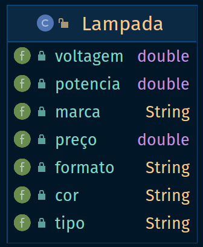
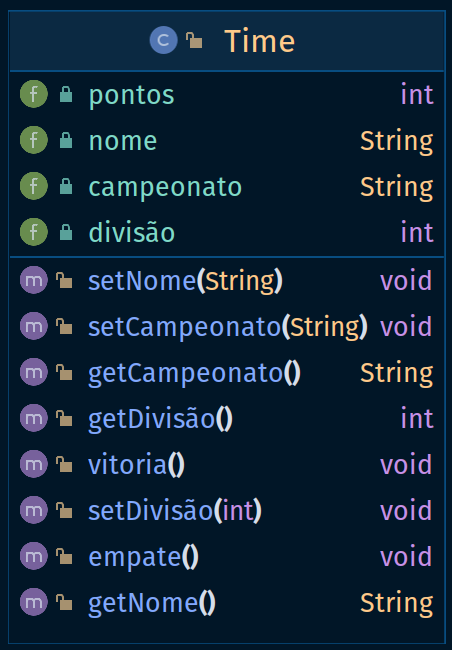

#### 1. Escreva um modelo para representar uma lâmpada que está à venda em um supermercado. Que dados devem ser representados por esse modelo?

##### Resposta:



#### 2. Crie um modelo para representar um time de um esporte qualquer em um campeonato desse esporte. Que dados e operações esse modelo deve ter?

##### Resposta:



#### 3. Modifique a operação mostraDados do modelo ContaBancariaSimplificada() para que, caso o saldo esteja negativo, uma mensagem de alerta seja impressa. Dica: O saldo só poderá ser negativo se a conta for especial.

##### Resposta:

Para que o método mostraDados passe a ter essa nova funcionalidade o código deverá ser:

```java
void mostraDados(){
    System.out.print("O nome do correntista é ");
    System.out.print(nomeDoCorrentista);
    System.out.print("O saldo é ");
    System.out.print(saldo);
    if(contaÉEspecial)
        System.out.print("ALERTA: O seu saldo está negativo");
    else
        System.out.print("A conta é comum");
} 
```

#### 4. Crie uma classe em Java correspondente ao modelo criado na questão 1.

##### Resposta:

Ver classe Lampada.java nos arquivos

#### 5. Crie uma classe em Java correspondente ao modelo criado na questão2.

##### Resposta:

Ver classe Time.java nos arquivos

#### 6. Modifique o método “abreContaSimples” da classe “ContaBancariaSimplificada” de forma que o cliente só possa abrir uma conta com um valor mínimo de R$ 100,00.

##### Resposta:
```java
void abreContaSimples(String nome){
    nomeDoCorrentista = nome;
    saldo = 100.0;
    contaÉEspecial = false;
} 
```

#### 7. Identifique e explique o(s) erro(s) na classe abaixo:

```java
class Registro De Eleitor {
    /**
     * Declaração dos campos desta classe
     */
    int tituloDeEleitor; // número do título do eleitor
    String nome; // nome do eleitor
    short zonaEleitoral; // número da zona eleitoral
} // fim da classe
```

##### Resposta:

O principal erro da classe acima encontra-se no nome da classe, uma vez que a linguagem java não permite espaços na
denominação da classe, o compilador espera a abertura do bloco com "{" logo após o primeiro espaço encontrado no nome da
classe.

#### 8. Identifique e explique o(s) erro(s) na classe abaixo:

```java
   class Teste2 {
    /**
     * Declaração dos campos desta classe
     */
    int num1, num2;

    /**
     * Declaração dos métodos desta classe
     */
    int maior() {
        if (num1 > num2)
            return true;
        else
            return false;
    }

    void menor() {
        if (num1 < num2)
            return num1;
        else
            return num2;
    }
} // fim da classe
```

##### Resposta:

No caso acima o erro encontra-se nos retornos dos métodos maior() e menor(), de modo que maior requer o retorno de um
inteiro e no código acima um booleano está sendo retornado, assim como o método menor que em sua assinatura não retorna
nenhum tipo e no corpo do método um inteiro está sendo retornado.

#### 9. Identifique e explique o(s) erro(s) na classe abaixo.

```java
   class TesteImpressao {
    main(String[] args) {
        System.out.println("7 + 2 =" + (7 + 2));
        System.out.println("7 - 2 =" + (7 - 2));
        System.out.println("7 * 2 =" + (7 * 2));
        System.out.println("7 / 2 =" + (7 / 2));
        return true;
    }
} // fim da classe
```

##### Resposta:

Para que a classe possa ser executada pela máquina virtual Java, não basta a existência de um método chamado main – esse
método deve ter obrigatoriamente os modificadores public static(nesta ordem), devendo retornar void e receber como
argumento um array (agrupamento, conjunto ou lista) de instâncias da classe String; ou seja, deve ser declarado como
public static void main(String[] argumentos).
